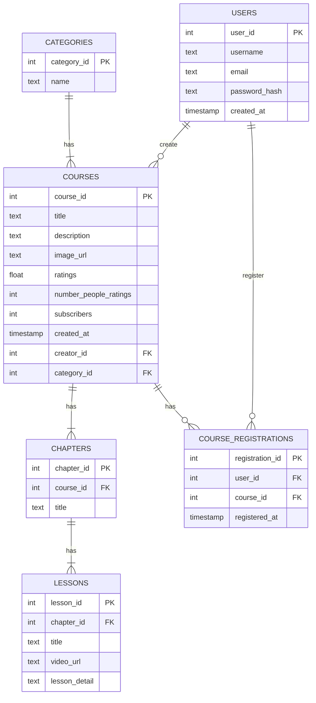

```mermaid
erDiagram
    USERS {
        int user_id PK
        text username
        text email
        text password_hash
        timestamp created_at
    }

    COURSES {
        int course_id PK
        text title
        text description
        text image_url
        float ratings
        int number_people_ratings
        int subscribers
        timestamp created_at
        int creator_id FK
        int category_id FK
    }

    CATEGORIES {
        int category_id PK
        text name
    }

    CHAPTERS {
        int chapter_id PK
        int course_id FK
        text title
    }

    LESSONS {
        int lesson_id PK
        int chapter_id FK
        text title
        text video_url
        text lesson_detail
    }

    COURSE_REGISTRATIONS {
        int registration_id PK
        int user_id FK
        int course_id FK
        timestamp registered_at
    }

    USERS ||--o{ COURSES: "create"
    USERS ||--o{ COURSE_REGISTRATIONS: "register"
    COURSES ||--o{ COURSE_REGISTRATIONS: "has"
    CHAPTERS ||--|{ LESSONS: "has"
    COURSES ||--|{ CHAPTERS: "has"
    CATEGORIES ||--|{ COURSES: "has"
```
